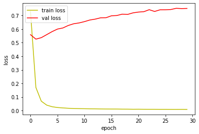
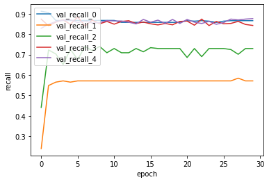
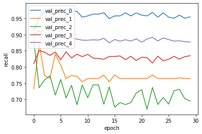
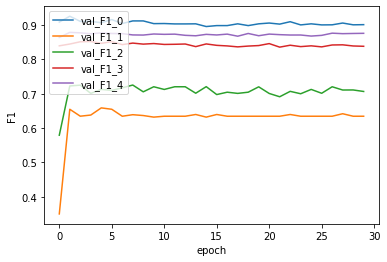
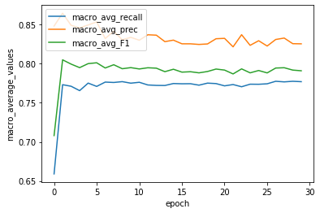

# Vanilla 신경망 실험 결과 분석입니다.


```python
# -*- coding: utf-8 -*-
import json # import json module
import numpy as np
import csv
import pickle
import math
import codecs
import copy
import keras
import tensorflow as tf
from keras.models import Sequential
from keras.layers import Dense, Activation
from keras import backend as K
from keras import optimizers
```

    Using TensorFlow backend.


```python
with open('./history/vanilla_history.pickle', 'rb') as f:
    acc_history = pickle.load(f)
```

## Loss 분석

학습이 진행될 수록, 가중치를 (미분값(back propagation값)xlearning rate) 값 만큼 train data의 loss를 줄이는 방향으로 갱신하므로 

train data의 loss는 지속적으로 낮아지게 됩니다.

하지만 data의 절대적인 양이 절대적으로 많지 않고, 

현재 신경망이 단순하기 때문에

(은닉층의 계층 수가 적고, node수가 적습니다 => 가중치의 개수가 적고, 그만큼 학습할 수 있는 입력 데이터의 패턴이 적다고 생각합니다. )

초기 에폭까지만 valiation set의 loss가 감소하고, 그 이후에는 loss 값이 증가합니다.

loss 값만 놓고 판단했을 때에는 overfitting으로 판단 할 수 있겠습니다.


```python
%matplotlib inline
import matplotlib.pyplot as plt

fig, loss_ax = plt.subplots()

loss_ax.plot(acc_history['loss'], 'y', label='train loss')
loss_ax.plot(acc_history['val_loss'], 'r', label='val loss')

loss_ax.set_xlabel('epoch')
loss_ax.set_ylabel('loss')

loss_ax.legend(loc='upper left')

plt.show()
```





## Recall(재현율) 분석


```python
%matplotlib inline
import matplotlib.pyplot as plt

fig, loss_ax = plt.subplots()

loss_ax.plot(acc_history['val_recall'], label='val_recall_0')
loss_ax.plot(acc_history['val_recall_1'], label='val_recall_1')
loss_ax.plot(acc_history['val_recall_2'], label='val_recall_2')
loss_ax.plot(acc_history['val_recall_3'], label='val_recall_3')
loss_ax.plot(acc_history['val_recall_4'], label='val_recall_4')

loss_ax.set_xlabel('epoch')
loss_ax.set_ylabel('recall')

loss_ax.legend(loc='upper left')

plt.show()
```





loss의 감소 동향과 Recall의 증가 동향은 유사합니다.

초기 에폭에서만 각 class의 Recall이 증가하고, 그 이후에는 일정하게 유지됩니다.

train data의 loss가 지속적으로 증가했으므로 loss만 보고 판단한다면

잘못 학습한 것이므로, recall도 감소해야할것 같지만 그러진 않았습니다.

이는, 비록 validation의 loss는 증가했지만, train data의 loss가 작아지는 방향으로 학습했으므로,

더이상의 학습이 이뤄지지는 않더라도, 성능은 유지한 것이라고 추측했습니다.

각 클래스마다 Recall의 최대치 역시 다른것을 확인 할 수 있습니다.

1번과 2번 클래스가 특히 재현률이 낮습니다.

1번 클래스는 데이터 베이스 관련, 2번 클래스는 응용프로그램 관련문서들입니다.

각 클래스들의 절대적인 data양과 각 클래스들의 종류를 결과와 연결지어 분석해보겠습니다.


```python
with open('train_labels.pickle', 'rb') as f:
    train_labels = pickle.load(f)
with open('train_data.pickle', 'rb') as f:
    train_data = pickle.load(f)
with open('test_labels.pickle', 'rb') as f:
    test_labels = pickle.load(f)
with open('test_data.pickle', 'rb') as f:
    test_data = pickle.load(f)
```


```python
print(np.sum(train_labels[:,0]==1))
print(np.sum(train_labels[:,1]==1))
print(np.sum(train_labels[:,2]==1))
print(np.sum(train_labels[:,3]==1))
print(np.sum(train_labels[:,4]==1))
```

    314
    198
    404
    1386
    1175


1번 클래스와 2번 클래스의 문서가 상대적으로 양이 적은것을 확인할 수 있습니다.

다른 클래스들의 문서는 컴퓨터와 관련된 문서인 반면, 0번 클래스 혼자 음악 관련 문서이므로, 

학습할 수 있는 data양이 적더라도 학습이 잘 될 수 있을것이라고 추측할 수 있을 것입니다.

다시 말해, 1번 클래스와 2번 클래스를 특징하는 단어들은 3번 클래스와 4번 클래스의 문서들에도 출현할 가능성이 높으므로 

신경망은 해당 단어를 3번 클래스와 4번 클래스를 특징하는 단어로 학습할 가능성이 높습니다.

반면, 0번 클래스를 특징하는 단어들은 다른 클래스들의 문서에 출현할 가능성이 적으므로,

다른 클래스로 오분류될 가능성이 적을 것입니다.

# Precision 분석


```python
%matplotlib inline
import matplotlib.pyplot as plt

fig, loss_ax = plt.subplots()

loss_ax.plot(acc_history['val_prec'], label='val_prec_0')
loss_ax.plot(acc_history['val_prec_1'], label='val_prec_1')
loss_ax.plot(acc_history['val_prec_2'], label='val_prec_2')
loss_ax.plot(acc_history['val_prec_3'], label='val_prec_3')
loss_ax.plot(acc_history['val_prec_4'], label='val_prec_4')

loss_ax.set_xlabel('epoch')
loss_ax.set_ylabel('recall')

loss_ax.legend(loc='upper left')

plt.show()
```





Precision은 절대적으로 Recall에 비해 높은 값들을 갖습니다.

학습 성능이 좋지 않았던 1번 클래스와 2번 클래스를 놓고 보아도, 많이 높은 값을 갖는다는 것을 알 수 있습니다.

Precision이 Recall보다 높은 값을 갖는다는 것은, 

제가 설정한 threshold가 Precision과 Recall이 같아지는 지점보다는 높은 값이라는 의미일 것입니다.  

2번 클래스는 초반 에폭에서는 높은 값을 갖다가 에폭이 진행될 수록 오히려 precision이 감소하는 경향을 보이는데,

이는 가중치를 initialize 했을때, 2번 클래스를 잘 분류할 수 있는 값으로 initialize 했으나, 

학습이 진행될 수록 2번클래스와 다른 클래스에 중복되어 출현하는 단어를 다른 클래스를 특징하도록 학습하게 되기 때문이라고 보여집니다. 

그 이유는 위에서 언급했듯이, 2번 클래스에 속한 train data의 절대적인 양이 다른 클래스에 비해 적기 때문일 것입니다. 

그리고 Recall 그래프에 비해 상당히 들쑥날쑥한 모양을 갖는데, 이는 단순히 precision의 그래프가 y축의 좁은 영역만을 그리고 있기 때문입니다.

## F1 분석 


```python
## %matplotlib inline
import matplotlib.pyplot as plt

fig, loss_ax = plt.subplots()

loss_ax.plot(acc_history['val_F1'], label='val_F1_0')
loss_ax.plot(acc_history['val_F1_1'], label='val_F1_1')
loss_ax.plot(acc_history['val_F1_2'], label='val_F1_2')
loss_ax.plot(acc_history['val_F1_3'], label='val_F1_3')
loss_ax.plot(acc_history['val_F1_4'], label='val_F1_4')

loss_ax.set_xlabel('epoch')
loss_ax.set_ylabel('F1')

loss_ax.legend(loc='upper left')

plt.show()
```





Loss, Recall 분석에서 언급한 것과 마찬가지로, 초반 에폭에서 많은 학습이 되다가 그 이후로는 정체된 것을 볼 수 있습니다.

## macro averaging 분석 


```python
# %matplotlib inline
import matplotlib.pyplot as plt

fig, loss_ax = plt.subplots()

loss_ax.plot(acc_history['val_macro_avg_recall_th'], label= 'macro_avg_recall')
loss_ax.plot(acc_history['val_macro_avg_prec_th'], label='macro_avg_prec')
loss_ax.plot(acc_history['val_macro_avg_F1_th'], label='macro_avg_F1')

loss_ax.set_xlabel('epoch')
loss_ax.set_ylabel('macro_average_values')

loss_ax.legend(loc='upper left')

plt.show()
```





모든 클래스가 Precision과 Recall에서 비슷한 학습 경향을 보였기에 

macro averaging에서도 유사한 학습 경향을 보여주고 있습니다.

위에서 언급했듯이 Precision의 그래프가 Recall의 그래프보다 위에 위치한 것을 볼 수 있는데,

이는 제가 설정한 threshold의 값이 상대적으로 높은 값이라는 것을 의미합니다.

## Next Experiment Point 

validation data의 loss가 초반 에폭에서만 감소하고 그 이후에서는 증가하는 경향을 보였습니다.

이는 overfitting의 여지로 보여집니다.

Overfittin의 경향과 Node수의 연관관계를 찾기 위해 

Node수를 줄이고 실험을 진행해보겠습니다.

(Node 수를 늘이면 학습 시간이 길어지기 때문에, 줄이는 방향을 선택했습니다.)
