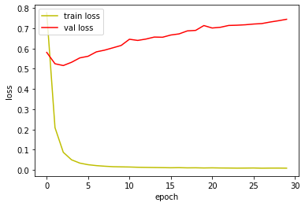

# 15,000개 노드에서 10,000개 노드로 줄인 실험 결과 분석 입니다


```python
# -*- coding: utf-8 -*-
import json # import json module
import numpy as np
import csv
import pickle
import math
import codecs
import copy
import keras
import tensorflow as tf
from keras.models import Sequential
from keras.layers import Dense, Activation
from keras import backend as K
from keras import optimizers
```

    Using TensorFlow backend.


```python
with open('./history/vanila_history_simpler.pickle', 'rb') as f:
    acc_history = pickle.load(f)
```

# Loss 분석 


```python
%matplotlib inline
import matplotlib.pyplot as plt

fig, loss_ax = plt.subplots()

loss_ax.plot(acc_history['loss'], 'y', label='train loss')
loss_ax.plot(acc_history['val_loss'], 'r', label='val loss')

loss_ax.set_xlabel('epoch')
loss_ax.set_ylabel('loss')

loss_ax.legend(loc='upper left')

plt.show()
```





은닉층의 Node수가 15,000개인 실험과 비교했을 때,

육안상으로 차이를 찾기 힘듭니다.

이는, 15,000개의 5,000개는 1/3으로 비중이 크지만,

절대적으로는 두 숫자 모두 크기 때문에, loss에는 영향이 없다고 추측했습니다.


# 그 이후로의 지표들 모두, 초기 신경망과 매우 유사하므로 분석을 생략합니다.


```python

%matplotlib inline
import matplotlib.pyplot as plt

fig, loss_ax = plt.subplots()

loss_ax.plot(acc_history['val_recall'], label='val_recall_0')
loss_ax.plot(acc_history['val_recall_1'], label='val_recall_1')
loss_ax.plot(acc_history['val_recall_2'], label='val_recall_2')
loss_ax.plot(acc_history['val_recall_3'], label='val_recall_3')
loss_ax.plot(acc_history['val_recall_4'], label='val_recall_4')

loss_ax.set_xlabel('epoch')
loss_ax.set_ylabel('recall')

loss_ax.legend(loc='upper left')

plt.show()
```


```python
%matplotlib inline
import matplotlib.pyplot as plt

fig, loss_ax = plt.subplots()

loss_ax.plot(acc_history['val_prec'], label='val_prec_0')
loss_ax.plot(acc_history['val_prec_1'], label='val_prec_1')
loss_ax.plot(acc_history['val_prec_2'], label='val_prec_2')
loss_ax.plot(acc_history['val_prec_3'], label='val_prec_3')
loss_ax.plot(acc_history['val_prec_4'], label='val_prec_4')

loss_ax.set_xlabel('epoch')
loss_ax.set_ylabel('recall')

loss_ax.legend(loc='upper left')

plt.show()
```


```python
%matplotlib inline
import matplotlib.pyplot as plt

fig, loss_ax = plt.subplots()

loss_ax.plot(acc_history['val_F1'], label='val_F1_0')
loss_ax.plot(acc_history['val_F1_1'], label='val_F1_1')
loss_ax.plot(acc_history['val_F1_2'], label='val_F1_2')
loss_ax.plot(acc_history['val_F1_3'], label='val_F1_3')
loss_ax.plot(acc_history['val_F1_4'], label='val_F1_4')

loss_ax.set_xlabel('epoch')
loss_ax.set_ylabel('F1')

loss_ax.legend(loc='upper left')

plt.show()
```


```python
%matplotlib inline
import matplotlib.pyplot as plt

fig, loss_ax = plt.subplots()

loss_ax.plot(acc_history['val_macro_avg_recall_th'], label= 'macro_avg_recall')
loss_ax.plot(acc_history['val_macro_avg_prec_th'], label='macro_avg_prec')
loss_ax.plot(acc_history['val_macro_avg_F1_th'], label='macro_avg_F1')

loss_ax.set_xlabel('epoch')
loss_ax.set_ylabel('macro_average_values')

loss_ax.legend(loc='upper left')

plt.show()
```


# Next Experiment Point 

1번, 2번 클래스를 특징짓는 단어들이 동사에 많이 포함되어 있을 수 있으므로, 

동사를 포함한 채로 학습을 진행해보겠습니다.
