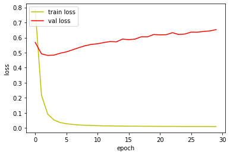
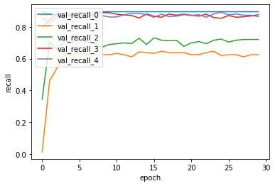
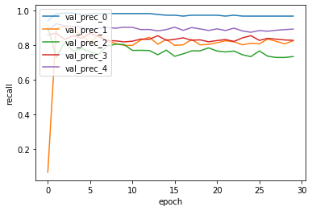
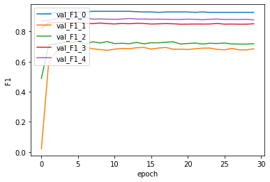
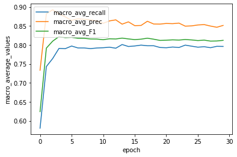

```python
# -*- coding: utf-8 -*-
import json # import json module
import numpy as np
import csv
import pickle
import math
import codecs
import copy
import keras
import tensorflow as tf
from keras.models import Sequential
from keras.layers import Dense, Activation
from keras import backend as K
from keras import optimizers
```

    Using TensorFlow backend.


```python
with open('./history/vanila_history_with_v.pickle', 'rb') as f:
    acc_history = pickle.load(f)
```

# Loss분석


```python
%matplotlib inline
import matplotlib.pyplot as plt

fig, loss_ax = plt.subplots()

loss_ax.plot(acc_history['loss'], 'y', label='train loss')
loss_ax.plot(acc_history['val_loss'], 'r', label='val loss')

loss_ax.set_xlabel('epoch')
loss_ax.set_ylabel('loss')

loss_ax.legend(loc='upper left')

plt.show()
```





Loss의 증감 추세는 전 실험과 매우 유사합니다.

다만, validation loss의 증가 추세가 전 실험보다 조금 더 작은 경향을 보이는데,

이는 동사가 문서 분류 학습에 도움을 주었기 때문이라고 추측해볼 수 있습니다.

# Recall 분석


```python
%matplotlib inline
import matplotlib.pyplot as plt

fig, loss_ax = plt.subplots()

loss_ax.plot(acc_history['val_recall'], label='val_recall_0')
loss_ax.plot(acc_history['val_recall_1'], label='val_recall_1')
loss_ax.plot(acc_history['val_recall_2'], label='val_recall_2')
loss_ax.plot(acc_history['val_recall_3'], label='val_recall_3')
loss_ax.plot(acc_history['val_recall_4'], label='val_recall_4')

loss_ax.set_xlabel('epoch')
loss_ax.set_ylabel('recall')

loss_ax.legend(loc='upper left')

plt.show()
```





다른 클래스들의 recall은 전 실험과 유사하지만, 

1번 클래스의 recall이 전 실험에서는 0.55정도의 값을 가졌지만

이번 실험에서는 0.6정도의 값을 가지면서 상향된것을 확인할 수 있습니다.

이는, 1번 클래스를 특징하는 단어들이 동사에 많이 포함되어있다고 추측할 수 있습니다.

# Precision 분석


```python
%matplotlib inline
import matplotlib.pyplot as plt

fig, loss_ax = plt.subplots()

loss_ax.plot(acc_history['val_prec'], label='val_prec_0')
loss_ax.plot(acc_history['val_prec_1'], label='val_prec_1')
loss_ax.plot(acc_history['val_prec_2'], label='val_prec_2')
loss_ax.plot(acc_history['val_prec_3'], label='val_prec_3')
loss_ax.plot(acc_history['val_prec_4'], label='val_prec_4')

loss_ax.set_xlabel('epoch')
loss_ax.set_ylabel('recall')

loss_ax.legend(loc='upper left')

plt.show()
```





전 실험의 precision과 비교하면 대부분의 클래스의 값들이 향상되었습니다.

0번 클래스의 precision은 전 실험에서는 0.95정도였으나, 

이번 실험에서는 1에 가까운 값을 갖고,

2번 클래스의 precision은 전 실험에서는 0.73정도였으나,

이번 실험에서는 0.8에 가까운 값을 갖습니다.

# F1 분석 


```python
%matplotlib inline
import matplotlib.pyplot as plt

fig, loss_ax = plt.subplots()

loss_ax.plot(acc_history['val_F1'], label='val_F1_0')
loss_ax.plot(acc_history['val_F1_1'], label='val_F1_1')
loss_ax.plot(acc_history['val_F1_2'], label='val_F1_2')
loss_ax.plot(acc_history['val_F1_3'], label='val_F1_3')
loss_ax.plot(acc_history['val_F1_4'], label='val_F1_4')

loss_ax.set_xlabel('epoch')
loss_ax.set_ylabel('F1')

loss_ax.legend(loc='upper left')

plt.show()
```





전 실험과 비교하면 아주 조금 향상된 것을 확인할 수 있었습니다.

1번 클래스를 예를 들면, 전 실험에서는 0.65에 가까운 값을 갖지만,

이번 실험에서는 0.7에 가까운 값을 갖습니다.

## macro averaging 분석 


```python
%matplotlib inline
import matplotlib.pyplot as plt

fig, loss_ax = plt.subplots()

loss_ax.plot(acc_history['val_macro_avg_recall_th'], label= 'macro_avg_recall')
loss_ax.plot(acc_history['val_macro_avg_prec_th'], label='macro_avg_prec')
loss_ax.plot(acc_history['val_macro_avg_F1_th'], label='macro_avg_F1')

loss_ax.set_xlabel('epoch')
loss_ax.set_ylabel('macro_average_values')

loss_ax.legend(loc='upper left')

plt.show()
```





모든 클래스의 Precision과 Recall, F1 모두 전 실험에 비해 증가했으므로,

macro averaging 한 값 역시 증가 해야할 것입니다.

그래프로도 그 사실을 확인할 수 있었습니다.

# Next Experiment Point 

초반 에폭 이후로 validation data의 loss가 감소하는 문제를 해결하고 싶었습니다.

문제의 원인을 overfitting이라고 가정하고,

overfitting을 해결하는 대표적인 방법인 Regularization을 적용해보겠습니다.
