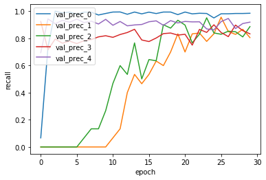

```python
# -*- coding: utf-8 -*-
import json # import json module
import numpy as np
import csv
import pickle
import math
import codecs
import copy
import keras
import tensorflow as tf
from keras.models import Sequential
from keras.layers import Dense, Activation
from keras import backend as K
from keras import optimizers
```

    Using TensorFlow backend.


```python
with open('./history/vanila_history_regularized.pickle', 'rb') as f:
    acc_history = pickle.load(f)
```

# Loss 분석 


```python
%matplotlib inline
import matplotlib.pyplot as plt

fig, loss_ax = plt.subplots()

loss_ax.plot(acc_history['loss'], 'y', label='train loss')
loss_ax.plot(acc_history['val_loss'], 'r', label='val loss')

loss_ax.set_xlabel('epoch')
loss_ax.set_ylabel('loss')

loss_ax.legend(loc='upper left')

plt.show()
```


loss function을 계산할때, 모든 가중치를 제곱한 값을 더해주기 때문에

train data, validation data 의 loss의 초기값이 전 실험보다 크지만,

에폭이 진행될 수록 validation data의 loss가 지속적으로 감소하는 것을 확인할 수 있습니다.

validation data의 loss가 증가하기 전의 에폭이

학습이 최대로 잘 되는 에폭으로 볼 수 있으므로, 에폭 수를 늘려서 학습해야 했지만

시간 관계상 30에폭까지밖에 진행하지 못했습니다.

# Recall 분석


```python
%matplotlib inline
import matplotlib.pyplot as plt

fig, loss_ax = plt.subplots()

loss_ax.plot(acc_history['val_recall'], label='val_recall_0')
loss_ax.plot(acc_history['val_recall_1'], label='val_recall_1')
loss_ax.plot(acc_history['val_recall_2'], label='val_recall_2')
loss_ax.plot(acc_history['val_recall_3'], label='val_recall_3')
loss_ax.plot(acc_history['val_recall_4'], label='val_recall_4')

loss_ax.set_xlabel('epoch')
loss_ax.set_ylabel('recall')

loss_ax.legend(loc='upper left')

plt.show()
```


loss 값은 지속적으로 감소하지만 Recall값은 전 실험과 비교하면 느린 속도로 증가하는 것을 볼 수 있습니다.

초반 에폭의 학습은 가중치의 절대값을 감소하기 위한 학습이고, 

그 이후의 학습이 실제 문서 분류 성능 개선을 위한 학습이 아닐까 추측했습니다.

# Precision 분석


```python
%matplotlib inline
import matplotlib.pyplot as plt

fig, loss_ax = plt.subplots()

loss_ax.plot(acc_history['val_prec'], label='val_prec_0')
loss_ax.plot(acc_history['val_prec_1'], label='val_prec_1')
loss_ax.plot(acc_history['val_prec_2'], label='val_prec_2')
loss_ax.plot(acc_history['val_prec_3'], label='val_prec_3')
loss_ax.plot(acc_history['val_prec_4'], label='val_prec_4')

loss_ax.set_xlabel('epoch')
loss_ax.set_ylabel('recall')

loss_ax.legend(loc='upper left')

plt.show()
```





Precision 역시 초기 에폭에는 큰 개선이 없다가 이후의 에폭에서 

비약적으로 증가한 것을 확인할 수 있습니다.

하지만 Recall 값이 낮으므로 Precision이 높다고 해서 신경망이 양질이라고 판단하기는 어려운 것 같습니다.

Threshold가 높아서 Precision이 높고, Recall이 낮은것일 수도 있기 때문입니다.

따라서, 해당 신경망을 제대로 평가하기 위해서는 

threshold를 낮춰가면서 precision이 여전히 높고, recall이 증가하는지 확인해야 할 것입니다.

이 실험에서 신경망이 양질인지 판단하는 것은 어렵지만, 학습의 추세는 추론할 수 있다고 생각합니다.

위에서 말했듯이, 초기에는 가중치의 절대값을 감소하는 방향으로 학습했고,

그 이후에는 문서 분류 성능 개선을 위한 방향으로 학습했다고 추론할 수 있습니다.

# F1 분석 


```python
%matplotlib inline
import matplotlib.pyplot as plt

fig, loss_ax = plt.subplots()

loss_ax.plot(acc_history['val_F1'], label='val_F1_0')
loss_ax.plot(acc_history['val_F1_1'], label='val_F1_1')
loss_ax.plot(acc_history['val_F1_2'], label='val_F1_2')
loss_ax.plot(acc_history['val_F1_3'], label='val_F1_3')
loss_ax.plot(acc_history['val_F1_4'], label='val_F1_4')

loss_ax.set_xlabel('epoch')
loss_ax.set_ylabel('F1')

loss_ax.legend(loc='upper left')

plt.show()
```


Recall과 Precision의 증가 추세는 유사하므로, F1 역시 두 그래프와 유사합니다.

# Macro averaging 분석


```python
%matplotlib inline
import matplotlib.pyplot as plt

fig, loss_ax = plt.subplots()

loss_ax.plot(acc_history['val_macro_avg_recall_th'], label= 'macro_avg_recall')
loss_ax.plot(acc_history['val_macro_avg_prec_th'], label='macro_avg_prec')
loss_ax.plot(acc_history['val_macro_avg_F1_th'], label='macro_avg_F1')

loss_ax.set_xlabel('epoch')
loss_ax.set_ylabel('macro_average_values')

loss_ax.legend(loc='upper left')

plt.show()
```


Precision이 높지만, Recall 값이 낮으므로, 

해당 신경망의 성능을 평가하기에는 어려움이 있습니다. 

threshold를 낮춰가며 실험을 진행해야 할 것입니다.

# Conclusion

validation data set의 loss값이 지속적으로 감소하므로 overfitting의 문제는 어느정도 해결하였으나,

에폭수가 해당 신경망을 충분히 학습하기에 충분하지 않아보입니다. 

에폭수를 늘려서 학습을 진행해보고,

threshold를 감소하여 precision이 높은 값으로 유지되고, recall 값이 증가하는지 확인해야 할 것입니다.

Regularization을 적용하지 않은 신경망과 비교하기엔, 

해당 신경망을 학습한 에폭수가 적다고 판단하여 비교 분석하는 부분은 생략했습니다.

# Next Experiment Point 

현재 신경망의 은닉층은 단일층입니다.

은닉층의 개수를 늘리면 학습이 어떻게 전게될지 확인해보겠습니다.
