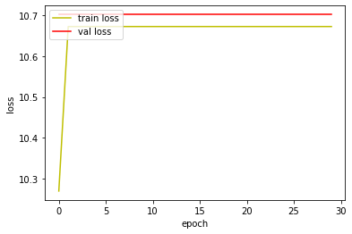
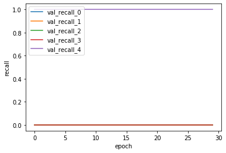
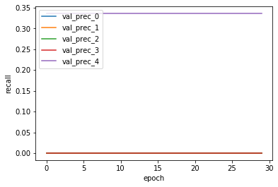
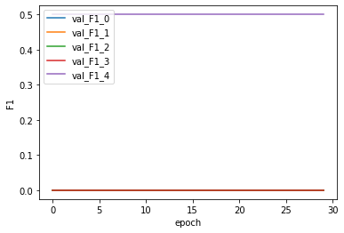
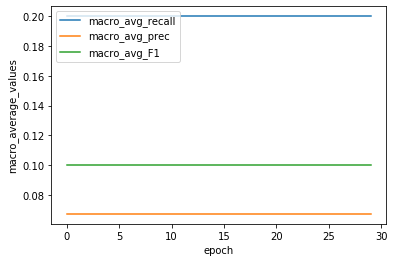

# Affine과 Relu만을 적용한 MLP를 
# Regularization을 적용하지 않은 단일계층 신경망과 비교해보겠습니다.
# 즉, 본 평가는 1_NLP_wtih_less_Nodes_eval와 비교하며 진행됩니다.


```python
# -*- coding: utf-8 -*-
import json # import json module
import numpy as np
import csv
import pickle
import math
import codecs
import copy
import keras
import tensorflow as tf
from keras.models import Sequential
from keras.layers import Dense, Activation
from keras import backend as K
from keras import optimizers
```

    Using TensorFlow backend.


```python
with open('./history/mlp_history.pickle', 'rb') as f:
    acc_history = pickle.load(f)
```

# Loss 분석 


```python
# %matplotlib inline
import matplotlib.pyplot as plt

fig, loss_ax = plt.subplots()

loss_ax.plot(acc_history['loss'], 'y', label='train loss')
loss_ax.plot(acc_history['val_loss'], 'r', label='val loss')

loss_ax.set_xlabel('epoch')
loss_ax.set_ylabel('loss')

loss_ax.legend(loc='upper left')

plt.show()
```





train의 loss값이 오히려 증가하고, val loss의 값은 큰 값을 고정적으로 유지합니다.

Loss 값이 오히려 증가하고 고정적으로 값을 유지하는 것은, 

output 계층으로부터 멀고, input 계층과 가까운 계층일수록 

미분값이 잘 전달되지 않기 때문일 것입니다.

거기에, 사실상 input data에 가장 큰 영향을 주는 것이 첫번째 은닉 계층일텐데,

이 계층이 학습이 진행되지 않으므로, loss의 값이 고정적인 것이라고 생각합니다.

또한, 계층이 많고 노드수가 많으므로 학습해야할 가중치가 많습니다.

하지만 그 가중치들이 학습이 제대로 이뤄지지 않으므로 해당 신경망은

학습이 제대로 진행되지 않습니다.

추가적으로, 해당 신경망에서는 Relu함수를 적용했습니다.

Sigmoid 함수는 funciton의 output이 0에 밀집 되어 있을때에만 잘 될 뿐만 아니라, 

그 구간의 output을 가질 수 있는 input의 구간이 상당히 좁기 때문이었습니다. 

sigmoid 함수는 신경망의 층이 깊어질 수록 미분값이 잘 전달 되지 않는다는 문제점 또한 가지고 있습니다. 

따라서 Relu 함수를 activation function으로 적용했지만, 

Relu 함수는 output이 0 혹은 양수뿐이라는 문제를 가지고 있습니다.

이는 다음 은닉층의 가중치들이 학습할 때, 다양한 방향으로 학습하지 못한다는 단점으로 이어집니다.

Affine 계층의 가중치를 Backpropagation을 적용하여 학습을 진행하면 상위 계층의 미분값에 하위 계층의 input 값을

곱한 값을 이용하여 값을 갱신하게 되는데,

이 input값이 양수만을 갖게 되면 해당 Affine 계층의 모든 가중치들은 상위 계층의 미분값과 같은 방향으로만 

학습할 수 있게 됩니다.

이는 기본적으로는 Hill climbing 알고리즘을 채택하고 있는 Adagrad optimization에 비효율을 안겨주게 됩니다.

따라서 추후의 실험에서는 Relu acivation funcion을 적용한 뒤, Batch normalization을 이용해 해당 문제를 완화할 계획입니다.


# Recall 분석


```python

%matplotlib inline
import matplotlib.pyplot as plt

fig, loss_ax = plt.subplots()

loss_ax.plot(acc_history['val_recall'], label='val_recall_0')
loss_ax.plot(acc_history['val_recall_1'], label='val_recall_1')
loss_ax.plot(acc_history['val_recall_2'], label='val_recall_2')
loss_ax.plot(acc_history['val_recall_3'], label='val_recall_3')
loss_ax.plot(acc_history['val_recall_4'], label='val_recall_4')

loss_ax.set_xlabel('epoch')
loss_ax.set_ylabel('recall')

loss_ax.legend(loc='upper left')

plt.show()
```





4번째 클래스만 recall이 1로 일정하다는 것은,

모델이 모든 data의 prediction을 4번째 클래스로 했다는 의미일 것입니다.

이는 두가지 원인이 있을 것입니다.

1. 가중치를 initialize할때 4번째 클래스를 선택하도록 initialize 되었다.

그리고 그 후에 학습이 되지 않았을 것입니다.

2. 학습이 진행되었다고 가정했을때, train data로 많이 주어진 class 쪽으로만 학습이 편중되어 진행되었다. 

4번째 클래스는 절대적으로 train data 양이 많은 class 입니다.

하지만 이 논리로는 

3번째 클래스가 4번째 클래스보다 절대적으로 양이 많은데,

왜 4번째 클래스를 골랐는지는 설명하지 못합니다.

# 이후의 metrics는 동일한 논리로 설명되기 때문에 생략합니다.


```python
## %matplotlib inline
import matplotlib.pyplot as plt

fig, loss_ax = plt.subplots()

loss_ax.plot(acc_history['val_prec'], label='val_prec_0')
loss_ax.plot(acc_history['val_prec_1'], label='val_prec_1')
loss_ax.plot(acc_history['val_prec_2'], label='val_prec_2')
loss_ax.plot(acc_history['val_prec_3'], label='val_prec_3')
loss_ax.plot(acc_history['val_prec_4'], label='val_prec_4')

loss_ax.set_xlabel('epoch')
loss_ax.set_ylabel('recall')

loss_ax.legend(loc='upper left')

plt.show()
```





```python
%matplotlib inline
import matplotlib.pyplot as plt

fig, loss_ax = plt.subplots()

loss_ax.plot(acc_history['val_F1'], label='val_F1_0')
loss_ax.plot(acc_history['val_F1_1'], label='val_F1_1')
loss_ax.plot(acc_history['val_F1_2'], label='val_F1_2')
loss_ax.plot(acc_history['val_F1_3'], label='val_F1_3')
loss_ax.plot(acc_history['val_F1_4'], label='val_F1_4')

loss_ax.set_xlabel('epoch')
loss_ax.set_ylabel('F1')

loss_ax.legend(loc='upper left')

plt.show()
```





```python
%matplotlib inline
import matplotlib.pyplot as plt

fig, loss_ax = plt.subplots()

loss_ax.plot(acc_history['val_macro_avg_recall_th'], label= 'macro_avg_recall')
loss_ax.plot(acc_history['val_macro_avg_prec_th'], label='macro_avg_prec')
loss_ax.plot(acc_history['val_macro_avg_F1_th'], label='macro_avg_F1')

loss_ax.set_xlabel('epoch')
loss_ax.set_ylabel('macro_average_values')

loss_ax.legend(loc='upper left')

plt.show()
```





# Next Experiment Point

Affine layer에 Regularization을 적용해보겠습니다.
