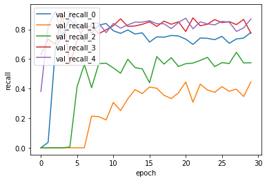

# Regularization을 추가적으로 적용하여 진행한 실험입니다.
# 해당 분석은 4_NLP_MLP_eval 실험과의 비교를 통해 Regularization의 효과에 집중했습니다.


```python
# -*- coding: utf-8 -*-
import json # import json module
import numpy as np
import csv
import pickle
import math
import codecs
import copy
import keras
import tensorflow as tf
from keras.models import Sequential
from keras.layers import Dense, Activation
from keras import backend as K
from keras import optimizers
```

    Using TensorFlow backend.


```python
with open('./history/mlp_history_regularized.pickle', 'rb') as f:
    acc_history = pickle.load(f)
```

# Loss 분석 


```python
%matplotlib inline
import matplotlib.pyplot as plt

fig, loss_ax = plt.subplots()

loss_ax.plot(acc_history['loss'], 'y', label='train loss')
loss_ax.plot(acc_history['val_loss'], 'r', label='val loss')

loss_ax.set_xlabel('epoch')
loss_ax.set_ylabel('loss')

loss_ax.legend(loc='upper left')

plt.show()
```


train data의 loss는 지속적으로 감소했지만, 

validation data set의 loss는 작은폭으로 감소한 후에, 고정적인 값을 유지합니다.

이는 regularization을 통해 overfitting은 방지한것으로 보여지지만,

그렇다고 validation loss를 감소하지도 못했기에, 학습이 잘 이뤄지지는 않았을 것이라고 추측했습니다.

Regularizatoin을 적용하지 않은 MLP는 loss가 오히려 증가하며 학습이 진행되지 않은 반면,

Regularizatoin을 적용했을때, loss값이 줄어들면서 학습이 진행되게 된 이유는 

가중치의 개수가 절대적으로 많아진 상태에서 가중치의 절대값의 크기가 가지는 의미가 

그만큼 컸기 때문이라고 생각합니다.

즉 가중치의 개수가 많고 여러번 선형변환을 거쳐야 하는데 그 가중치들의 절대값이 크면, 

세세한 input의 변화에도 옳은 예측을 해야하는 신경망 모델에 안좋은 영향을 줄것입니다.

그러므로 단일 계층이었던 신경망과 비교하면, 다층 신경망에서 regularization을 적용하였을 때

더 좋은 효과를 얻게 된것이라고 추론합니다.

# Recall 분석


```python
%matplotlib inline
import matplotlib.pyplot as plt

fig, loss_ax = plt.subplots()

loss_ax.plot(acc_history['val_recall'], label='val_recall_0')
loss_ax.plot(acc_history['val_recall_1'], label='val_recall_1')
loss_ax.plot(acc_history['val_recall_2'], label='val_recall_2')
loss_ax.plot(acc_history['val_recall_3'], label='val_recall_3')
loss_ax.plot(acc_history['val_recall_4'], label='val_recall_4')

loss_ax.set_xlabel('epoch')
loss_ax.set_ylabel('recall')

loss_ax.legend(loc='upper left')

plt.show()
```





validation loss를 보고 예측한대로, 초기 에폭까지만 recall이 개선되고 그 이후에는 변동이 클뿐, recall이 개선되지는 않았습니다.

Regularaization을 적용하지 않은 MLP와 비교했을때, 1번 클래스와 2번 클래스의 recall이 많이 향상된것을 확인할 수 있는데,

이는 Regularization을 적용함으로써 가중치의 절대값이 작아지면서,

3번과 4번 클래스에 대해서 유사한 tf분포를 가졌을 1번과 2번 클래스의 문서들에 가중치를 곱하면서 선형변환을 행할때,

regularization을 통해 절대값이 작아진 가중치를 곱하게 되면서, 오류가 줄어든것이라고 추론할 수 있습니다.

# Precision 분석


```python
%matplotlib inline
import matplotlib.pyplot as plt

fig, loss_ax = plt.subplots()

loss_ax.plot(acc_history['val_prec'], label='val_prec_0')
loss_ax.plot(acc_history['val_prec_1'], label='val_prec_1')
loss_ax.plot(acc_history['val_prec_2'], label='val_prec_2')
loss_ax.plot(acc_history['val_prec_3'], label='val_prec_3')
loss_ax.plot(acc_history['val_prec_4'], label='val_prec_4')

loss_ax.set_xlabel('epoch')
loss_ax.set_ylabel('recall')

loss_ax.legend(loc='upper left')

plt.show()
```


Recall의 값 변화 패턴과 유사한 모양을 보여줍니다.

초반 에폭에만 증가 한뒤, 이후 에폭에서는 일정한 값을 유지합니다.

# 이후의 분석 내용은 유사하므로 생략합니다.


```python
%matplotlib inline
import matplotlib.pyplot as plt

fig, loss_ax = plt.subplots()

loss_ax.plot(acc_history['val_F1'], label='val_F1_0')
loss_ax.plot(acc_history['val_F1_1'], label='val_F1_1')
loss_ax.plot(acc_history['val_F1_2'], label='val_F1_2')
loss_ax.plot(acc_history['val_F1_3'], label='val_F1_3')
loss_ax.plot(acc_history['val_F1_4'], label='val_F1_4')

loss_ax.set_xlabel('epoch')
loss_ax.set_ylabel('F1')

loss_ax.legend(loc='upper left')

plt.show()
```


```python
%matplotlib inline
import matplotlib.pyplot as plt

fig, loss_ax = plt.subplots()

loss_ax.plot(acc_history['val_macro_avg_recall_th'], label= 'macro_avg_recall')
loss_ax.plot(acc_history['val_macro_avg_prec_th'], label='macro_avg_prec')
loss_ax.plot(acc_history['val_macro_avg_F1_th'], label='macro_avg_F1')

loss_ax.set_xlabel('epoch')
loss_ax.set_ylabel('macro_average_values')

loss_ax.legend(loc='upper left')

plt.show()
```


# Next Experiment Point

이전 문서에서 언급했던 Relu 함수로 인한 학습 disadvantage를 완화하기 위해

각 Affine 계층에 Batchnormalization을 추가하겠습니다.
