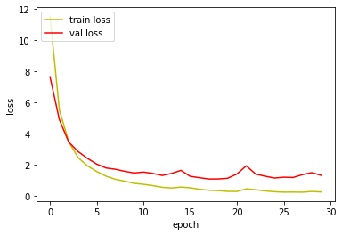
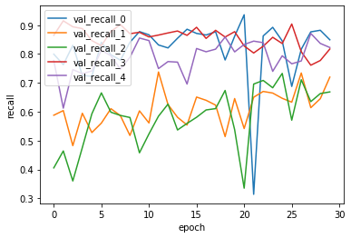
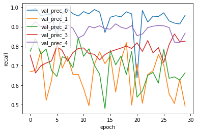
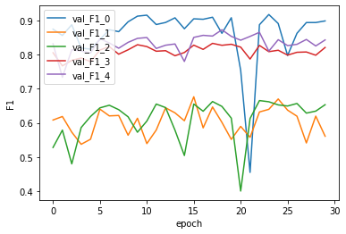
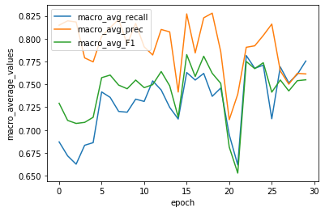

# Batch Normalization을 추가적으로 적용하여 진행한 실험입니다.
# 해당 분석은 5_NLP_MLP_Regularized_eval 실험과의 비교를 통해 Batch Normalization의 효과에 집중했습니다.


```python
# -*- coding: utf-8 -*-
import json # import json module
import numpy as np
import csv
import pickle
import math
import codecs
import copy
import keras
import tensorflow as tf
from keras.models import Sequential
from keras.layers import Dense, Activation
from keras import backend as K
from keras import optimizers
```

    Using TensorFlow backend.


```python
with open('./history/mlp_history_regularized_L2_BM_.pickle', 'rb') as f:
    acc_history = pickle.load(f)
```

# Loss 분석 


```python
%matplotlib inline
import matplotlib.pyplot as plt

fig, loss_ax = plt.subplots()

loss_ax.plot(acc_history['loss'], 'y', label='train loss')
loss_ax.plot(acc_history['val_loss'], 'r', label='val loss')

loss_ax.set_xlabel('epoch')
loss_ax.set_ylabel('loss')

loss_ax.legend(loc='upper left')

plt.show()
```





Loss 값이 절대적으로 크지만, 지속적으로 validation loss가 감소한것을 확인할 수 있습니다.

Batch normalization을 하게 되면서 Relu만을 적용했을때보다

한 계층의 가중치들이 여러 방향으로 학습할 수 있게 되면서, 

input data에 유연하게 가중치를 갱신하는 과정에서 가중치의 절대값이 커져서

loss값이 커질 수 있겠지만 

Regularaization을 동시에 적용했기에, 학습의 과정에 가중치의 절대값 역시 같이 고려할 것입니다.

# Metrics들 비교 

metrics들에 공통적으로 지표가 나쁜 구간이 있습니다.

20 에폭 주위 구간에서 loss도 높아지고, 다른 metrics들도 같이 지표가 나빠집니다.

사실상 부분적인 overfitting으로 보여지기에, 학습은 20에폭 전에 끝내는 것이 좋다고 생각합니다

20 에폭 주변을 제외하면, Batch Normalization을 적용한 신경망이 더 나은 지표를 보여줍니다.

이는 앞서 말했듯, Relu 함수의 한계점을 보완하여 유연하게 학습하게 된 결과로 보여집니다.


```python

%matplotlib inline
import matplotlib.pyplot as plt

fig, loss_ax = plt.subplots()

loss_ax.plot(acc_history['val_recall'], label='val_recall_0')
loss_ax.plot(acc_history['val_recall_1'], label='val_recall_1')
loss_ax.plot(acc_history['val_recall_2'], label='val_recall_2')
loss_ax.plot(acc_history['val_recall_3'], label='val_recall_3')
loss_ax.plot(acc_history['val_recall_4'], label='val_recall_4')

loss_ax.set_xlabel('epoch')
loss_ax.set_ylabel('recall')

loss_ax.legend(loc='upper left')

plt.show()
```





```python
%matplotlib inline
import matplotlib.pyplot as plt

fig, loss_ax = plt.subplots()

loss_ax.plot(acc_history['val_prec'], label='val_prec_0')
loss_ax.plot(acc_history['val_prec_1'], label='val_prec_1')
loss_ax.plot(acc_history['val_prec_2'], label='val_prec_2')
loss_ax.plot(acc_history['val_prec_3'], label='val_prec_3')
loss_ax.plot(acc_history['val_prec_4'], label='val_prec_4')

loss_ax.set_xlabel('epoch')
loss_ax.set_ylabel('recall')

loss_ax.legend(loc='upper left')

plt.show()
```





```python
%matplotlib inline
import matplotlib.pyplot as plt

fig, loss_ax = plt.subplots()

loss_ax.plot(acc_history['val_F1'], label='val_F1_0')
loss_ax.plot(acc_history['val_F1_1'], label='val_F1_1')
loss_ax.plot(acc_history['val_F1_2'], label='val_F1_2')
loss_ax.plot(acc_history['val_F1_3'], label='val_F1_3')
loss_ax.plot(acc_history['val_F1_4'], label='val_F1_4')

loss_ax.set_xlabel('epoch')
loss_ax.set_ylabel('F1')

loss_ax.legend(loc='upper left')

plt.show()
```





```python
%matplotlib inline
import matplotlib.pyplot as plt

fig, loss_ax = plt.subplots()

loss_ax.plot(acc_history['val_macro_avg_recall_th'], label= 'macro_avg_recall')
loss_ax.plot(acc_history['val_macro_avg_prec_th'], label='macro_avg_prec')
loss_ax.plot(acc_history['val_macro_avg_F1_th'], label='macro_avg_F1')

loss_ax.set_xlabel('epoch')
loss_ax.set_ylabel('macro_average_values')

loss_ax.legend(loc='upper left')

plt.show()
```





# 이상 보고서를 마치겠습니다.
# 감사합니다.


```python

```
